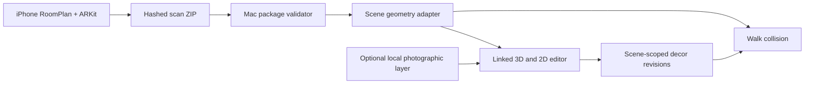

# Room Review

An iPhone and Mac prototype for capturing one interior room, inspecting its geometry, and placing 3D decor in a navigable scene. The scanner exports a verified RoomPlan package; a local browser editor connects a 3D walkthrough, a measured-scale floor plan, and scene-aware decor placement.

Built by **Roni Katcharovski** from Apple's RoomPlan sample. The verified export/import path, linked Mac editor, decor catalog, scene-scoped revisions, walkthrough collision, and experiments are project additions.


**[Watch the 20-second feature tour](docs/media/room-decor-tour.gif)** · [Download the MP4](docs/media/room-decor-tour.mp4) · [See the demo gallery](docs/DEMO.md) · [Read the research notes](docs/RESEARCH.md)

The tour uses screenshots of a real room prototype. Raw photographs, LiDAR buffers, scan archives, reconstructed room assets, and saved real-room revisions are not in this repository. The photographic scene shown in the tour is an experimental local render; it is recognizably the room but visibly soft in fine details.

## What works

- **Capture and transfer:** An iPhone RoomPlan session saves room geometry and optional camera/depth evidence in a ZIP with a manifest and SHA-256 hashes. A Mac importer validates the package before opening it. USB transfer was exercised on a physical phone.
- **Linked room review:** Select the same wall, opening, floor, or detected object in the 3D view, 2D plan, and inspector. Corrections and review decisions are saved as immutable revisions; the original scan is retained.
- **Decor placement:** A local catalog provides a chair, side table, framed painting, and fruit bowl. Floor, wall, and tabletop anchors store positions in scene coordinates. A bowl follows its support table when the table moves.
- **Walkthrough:** Walk mode uses RoomPlan floor boundaries, walls, openings, object estimates, and placed-prop collision boxes. It stops or slides at barriers and holds a fixed eye height. Orbit mode allows unrestricted inspection. A debug overlay exposes the barriers used by the solver.
- **Scene isolation:** Proposals and obstacle corrections belong to a scene ID. A second, synthetic room fixture loads different geometry without carrying over the first room's items.

## Try the public fixture

The full-room visual demo above uses private capture data. You can run the editor and placement controls with a **synthetic room** included in source:

```sh
fixture_root="$(mktemp -d)"
python3 laptop/make_alternate_scene.py "$fixture_root/sample-room"
python3 laptop/edit_room.py "$fixture_root/sample-room"
```

This opens a local URL on `127.0.0.1`. The fixture has a floor, partition, opening, and cabinet; it does not contain anyone's room photograph or a photographic reconstruction. The editor needs Python 3 and a WebGL-capable browser. Its Three.js and Spark viewer files are bundled locally.

To import a capture made with the iOS app, open `RoomPlanExampleApp.xcodeproj` in Xcode, run it on a LiDAR-capable iPhone, export a scan, and import its ZIP:

```sh
python3 laptop/import_scan.py "/path/to/RoomScan.zip" --open
```

The importer's expected core files are `manifest.json`, `Room.json`, and `Room.usdz`; the package may also contain RGB and depth evidence. See [the capture/import notes](MILESTONE1_STATUS.md) for the physically exercised path. Device signing and RoomPlan availability depend on the local Apple development setup.

## How it is built



The spatial logic uses **RoomPlan geometry**, with meters and explicit scene transforms. The optional photographic layer supplies appearance only; it does not determine collision, dimensions, or usable clearance. Asset identity, license, dimensions, anchors, and collision bounds are recorded in the [local catalog](laptop/editor/models/catalog.json).

## Evidence and limits

The scan-to-Mac flow was completed on a physical iPhone. The decor milestone passed Python and JavaScript tests, cold-reopened a saved four-prop revision, and exercised walking, wall stops, openings, furniture blocks, and an alternate scene in the browser. [Implementation evidence](DECOR_LIBRARY_STATUS.md) and [research notes](docs/RESEARCH.md) describe the checks.

RoomPlan objects and dimensions are **estimates**. Collision boxes are conservative navigation aids, not verified physical clearances. The photographed room layer has missing surfaces and blurred fine detail; neither it nor the props establish photorealism or a purchasable product match. The demo is one room, with a second synthetic scene used to check isolation.

## Repository layout

| Path | Purpose |
| --- | --- |
| `RoomPlanExampleApp/` | iPhone capture and export app |
| `laptop/import_scan.py` | Manifest, archive, and payload validation |
| `laptop/edit_room.py` + `laptop/editor/` | Local editor and linked 3D/2D interface |
| `laptop/scene_geometry.py` + `laptop/editor/navigation.js` | Scene adapter and walk collision |
| `laptop/furniture.py` + `laptop/editor/models/` | Decor catalog, placement, provenance, and saved revisions |
| `laptop/fixtures/` | Public synthetic scene |
| `docs/` | Demo and concise research record |

## Licenses and data

The project began from Apple's RoomPlan sample; its [license](LICENSE.txt) is retained. Bundled Three.js and Spark viewer licenses are in `laptop/editor/vendor/`. The chair is a [CC0 glTF sample](laptop/editor/models/README.md); the other decor assets are original [CC0 models](laptop/editor/models/ORIGINAL-ASSETS.md).

`scans/`, `design-inputs/`, `reconstructions/`, and `validation/` are ignored because they can contain private room imagery, positions, and local test evidence. The committed demo media is an intentionally selected, cropped visual excerpt of the prototype; it contains no raw capture package or navigable room model.
