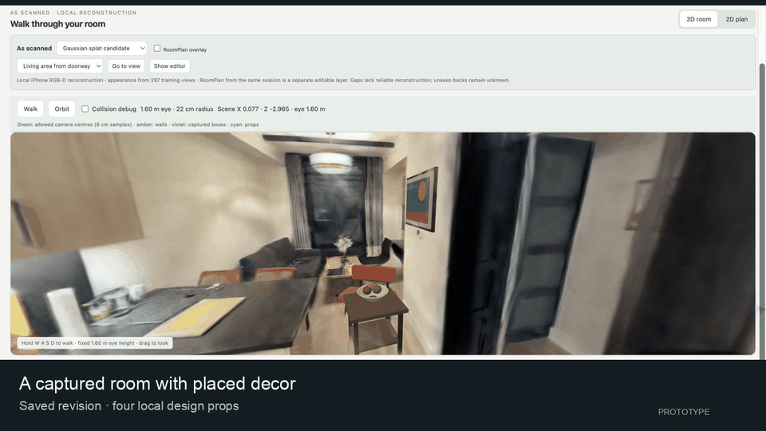
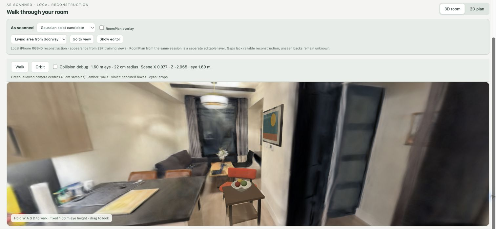
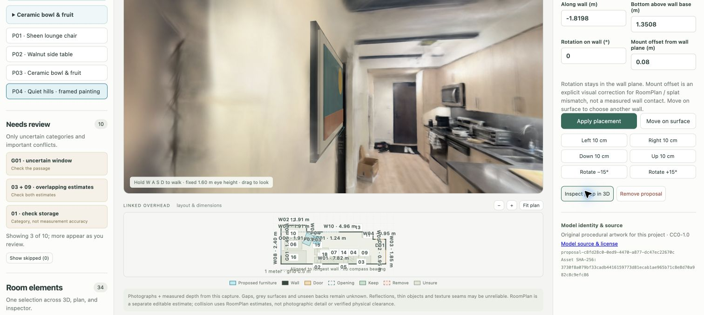
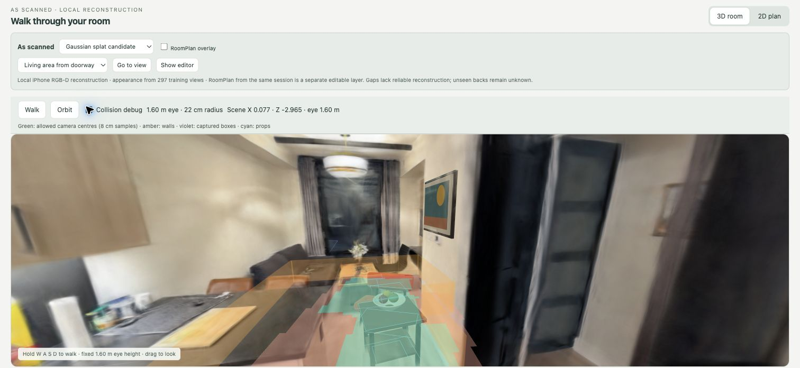
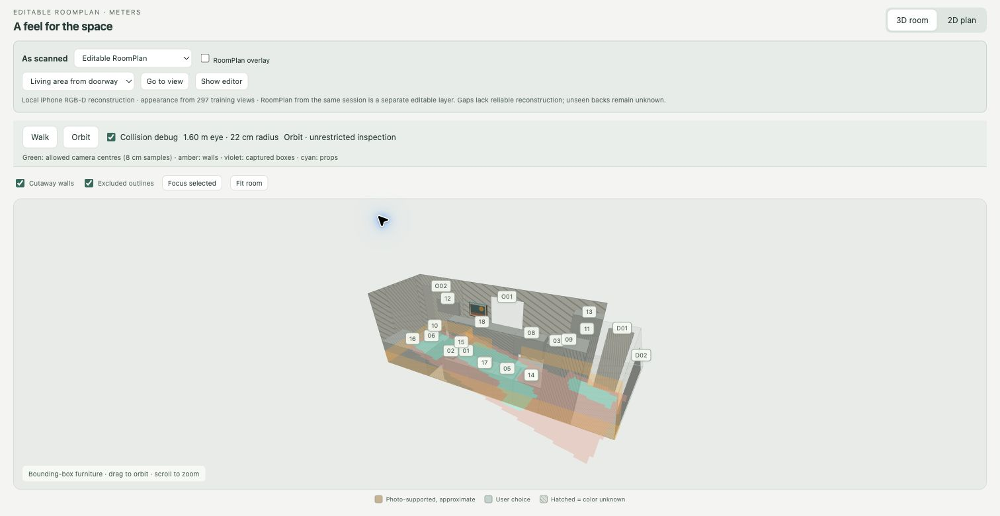

# Full-room furniture demo



[Download the MP4](media/room-decor-tour.mp4)

The tour is assembled from screenshots of a running local prototype. It shows a real captured room with four saved design props; it is **not** a recording of continuous movement, and the private room model is not included in this repository.

## Saved scene



The saved revision contains a lounge chair, side table, fruit bowl attached to the table, and wall-mounted framed painting. These are local design props with recorded dimensions and licenses. Existing furniture remains baked into the captured appearance and is not removed by adding props.

## Anchors and plan



Floor placement stays on the captured floor polygon. Wall art stores wall-local coordinates and checks nearby openings. The bowl follows its support table. The linked 2D plan and 3D view select the same proposal.

## Navigation geometry



The colored debug overlay exposes the floor, wall and obstacle estimates used by Walk mode. The photographic layer is visual context; it does not act as a collider.



Walk mode maintains a fixed 1.60 m camera height and 22 cm body radius, stops at wall/floor boundaries, and slides along obstacles. RoomPlan's object boxes and all placement clearances are estimates. Orbit mode remains unrestricted.

## Run the public substitute

The real scan, appearance model, and saved revision are private. The repository includes a synthetic room so the same editor and catalog can be exercised without those assets:

```sh
fixture_root="$(mktemp -d)"
python3 laptop/make_alternate_scene.py "$fixture_root/sample-room"
python3 laptop/edit_room.py "$fixture_root/sample-room"
```
